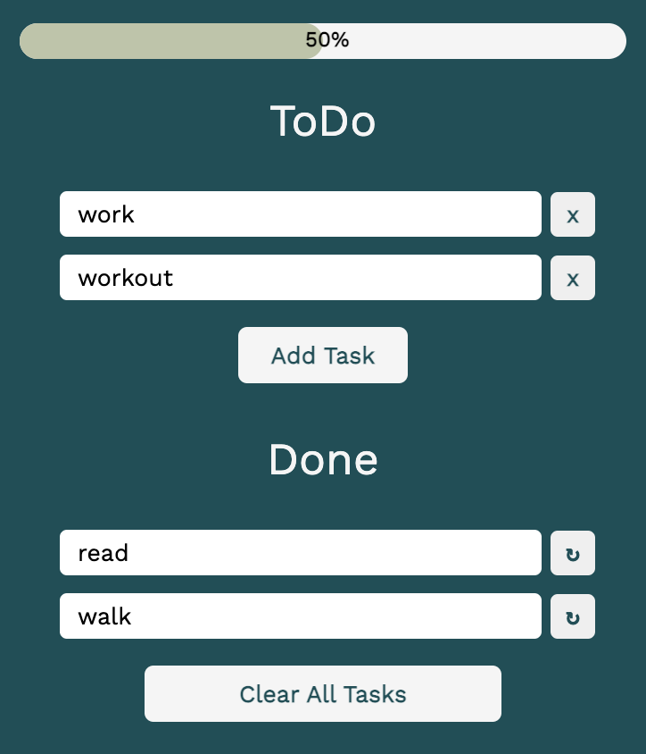

# Task List Chrome Extension

## Overview

Built a Chrome extension to manage tasks. Developed with HTML, CSS, JavaScript, and the Chrome API. This has not yet been published to the Chrome Web Store, but it can be used locally.

## Features

1. Add tasks
2. Edit tasks
3. Complete tasks
4. Clear all tasks
5. Organize tasks (`ToDo` and `Done` lists)
6. Change list task belongs to
7. Progress Bar
8. Customizable Options Page (currently not in use)
9. Number of uncompleted tasks shown in badge (preview below)

## Demo

### Icon & Badge

When you pin the chrome extension on your toolbar, you will see this icon with a badge indicating the number of unfinished tasks on your list:

### Popup

When you click on the icon, this will be the popup window where you can manage your tasks:

## Setup

1. Clone this repository to retrieve project contents locally
2. Navigate to `chrome://extensions/` on your Chrome window
3. Turn on Developer Mode
4. Select `Load Unpacked`
5. Select project folder
6. Go to toolbar on top of browser and pin extension
